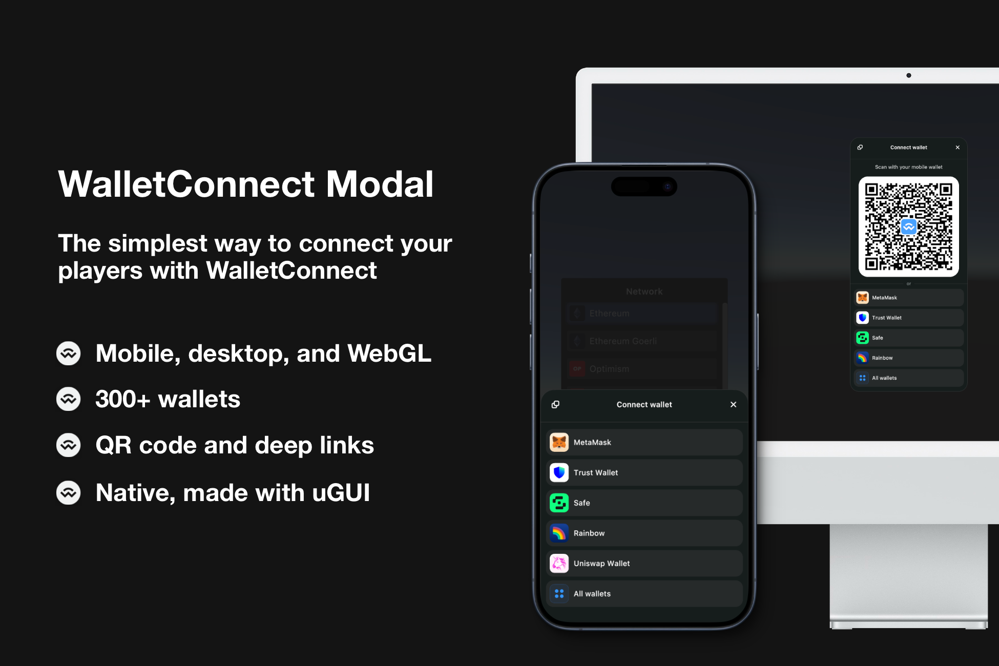

# WalletConnect Modal

> Simplest and most minimal way to connect your players with WalletConnect



## Supported Platforms

- Android, iOS
- Windows, macOS
- WebGL ([read this first](https://github.com/WalletConnect/WalletConnectUnity#webgl-usage))

## Prerequisites

- Unity 2021.3 or above
- IL2CPP code stripping level: Minimal (or lower)
- Project created in [WalletConnect Cloud](https://cloud.walletconnect.com)

## Documentation
* [WalletConnect Modal](https://docs.walletconnect.com/advanced/walletconnectmodal/about?platform=unity)

## Usage

0. Install WalletConnectUnity Modal package. If installing as Git URL, also install UI and Core packages.
1. Add Name (can be anything) and your Project ID to
   the `Assets/WalletConnectUnity/Resources/WalletConnectProjectConfig` asset.

   - If you don't have Project ID, you can create one in [WalletConnect Cloud](https://cloud.walletconnect.com).

2. Drag and drop `WalletConnectModal` prefab from `WalletConnectUnity Modal` package to the first scene in your game.
3. Open modal after initialization
   - By default Modal will initialize itself asynchronously on Awake. During initialization it will also try to connect
     to the last
     session.
   - After initialization, Modal invokes `WalletConnectModal.Ready` static event.
   - If `Ready` argument's `SessionResumed` is `true`, it means that Modal has successfully connected to the last
     session. In this case you don't need to open the modal. Otherwise, open the modal with `WalletConnectModal.Open()`
     static method.

```csharp
private void Start()
{
    WalletConnectModal.Ready += (sender, args) =>
    {
        if (args.SessionResumed)
        {
            // Session has been resumed, proceed to the game
        }
        else
        {
            // Session hasn't been resumed

            // Define required namespaces for new session
            var requiredNamespaces = new RequiredNamespaces
            {
                {
                    "eip155", new ProposedNamespace
                    {
                        Methods = new[]
                        {
                            "eth_sendTransaction",
                            "personal_sign",
                            "eth_signTypedData"
                        },
                        Chains = new[]
                        {
                            "eip155:1"
                        },
                        Events = new[]
                        {
                            "chainChanged",
                            "accountsChanged"
                        }
                    }
                }
            };

            var connectOptions = new ConnectOptions
            {
                RequiredNamespaces = requiredNamespaces
            };

            // Open modal
            WalletConnectModal.Open(new WalletConnectModalOptions
            {
                ConnectOptions = connectOptions
            });
        }
    };
}
```

5. Subscribe to `ActiveSessionChanged` and `SessionDeleted` events. It's recommended to do it in `Ready` event handler.

```csharp
WalletConnectModal.Ready += (sender, args) =>
{
    // ....

    // Invoked after wallet connected
    WalletConnect.Instance.ActiveSessionChanged += (_, sessionStruct) =>
    {
        // Session connected/updated, proceed to the game if sessionStruct.topic is not null/empty
    };

    // Invoked after wallet disconnected
    WalletConnect.Instance.SessionDisconnected += (_, _) =>
    {
        // Session deleted, show sign in screen
    };
};
```

## Sample

- [WalletConnect Modal Sample](https://github.com/WalletConnect/WalletConnectUnity/tree/main/Packages/com.walletconnect.modal/Samples~/Modal%20Sample#readme)
